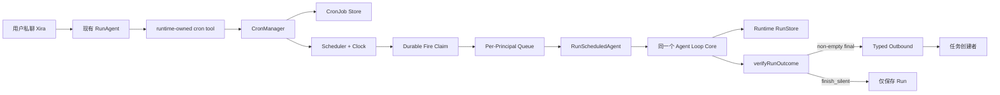

# Xira Cron v0 架构方案

> 状态：Proposed，尚未实现。
>
> 目标：为 Xira 增加可持久化、按 sender 隔离的周期任务和一次性任务能力。
>
> 核心约束：Cron 只提供新的触发方式；到点后复用现有 Agent Loop，不形成第二套 Runtime。

## 0. 结论

Xira v0 只实现一套 `CronManager` 和一个 runtime-owned `cron` tool。同一 entrypoint
下，每个授权 sender 拥有独立 Cron namespace。任务到点后以创建者作为服务端绑定的
Principal，启动不继承聊天 session 的 Scheduled Turn；非空 final 固定投递给创建者，
`finish_silent` 表示成功但不发送。

`owner` 只是 entrypoint 授权的一种来源，不是该 entrypoint 下所有 CronJob 的所有者，
也不自动获得管理其他 sender 任务的权限。

Cron 是持续消耗资源、定时主动联系用户的重行为，由此引出三个决策：

1. **同时支持周期任务和一次性任务**（§5.1、§7.1、§9）。
2. **agent 由用户在创建时刻显式选择并冻死**：多 agent 入口下未提候选 agent 时 create 被拒
   并反问，单 agent 入口豁免（§6.1）。
3. **Agent 失踪不静默 fallback**：Job 自动 pause + 投递带恢复选项的通知，由用户显式
   delete+create 选择新 agent（§11.2）。

## 1. 需求与边界

### 1.1 v0 必须支持

1. 授权 sender 在私聊中用自然语言 create/list/pause/resume/delete CronJob。
2. **同时支持周期任务（recurring，五字段 cron expression）和一次性任务（oneshot，单个
   `fire_at` + timezone）。两者共享 Principal、Scheduled Turn、Delivery、Fire claim 等基础
   设施。** 详见 §5.1、§7.1、§9。
3. 创建时持久化 `type`、`agent_id`、名称、时间字段（recurring: expression+timezone；
   oneshot: fire_at+timezone）和 Prompt。
4. sender 只能查看和管理自己的任务；同一 entrypoint 可安全服务多人。
5. 每个 Fire 使用新 ADK session，不读取聊天主 session 或聊天记录。
6. Scheduled Turn 加载创建者的 `user.md`、Sender Memory、目标 Agent 的 Agent Memory。
7. Scheduled Turn 的工具数据绑定创建者的 per-sender isolation scope。
8. Job、Run 和 Fire claim 重启可恢复；恢复未来调度但不补历史 Fire。
9. 每次 Fire 前重新验证 entrypoint、Principal、Agent、route 和工具权限。
10. 多 agent 入口下，create 时 `agent_id` 必须来自用户在 prompt 里的显式选择，否则 create
    被拒并由模型反问；单 agent 入口豁免（§6.1）。
11. Agent 在 fire 时不可用（被删除、被 allowed_agents 排除、route 不兼容）时，Job 自动 pause
    并投递带可操作恢复选项的通知；**不静默 fallback 到任何默认 agent**（§11.2）。
12. CronRun 分开记录 execution 与 delivery，投递失败不能重跑 Agent。

### 1.2 非功能要求

- 身份和 recipient 只能由服务端绑定，模型不能提供或覆盖。
- 单进程支持范围内，同一 Fire 只能 durable claim 一次。
- 有 per-sender 任务数、运行次数、并发和全局并发上限。
- Scheduler 注入 Clock；权限和状态机属于 100% 分支覆盖的契约代码。
- Cron 只负责任务、时间、编排和投递；模型执行继续由 Runtime 负责。
- Prompt、raw sender、final 和凭证不进入普通 Info 日志。

### 1.3 v0 不做

- 独立 HeartbeatManager；Heartbeat 未来编译成 system-owned CronJob。
- 秒级 Cron、descriptor、`update`、`run_now`。
- oneshot 任务的 pause/resume（一次性任务改期用 delete+create；周期任务支持 pause/resume）。
- 群聊创建、owner 跨用户管理、模型指定 recipient/delivery/allowed tools。
- Scheduled Turn HITL resume、Cron 自调用、spawn/delegation。
- 停机 catch-up、多进程共享 Store、CLI/HTTP 与 daemon 并发写 Store。
- 跨 channel person graph；同一人在不同 channel 拥有不同 Cron namespace。

## 2. 总体架构



系统只有一个模型执行核心：

```text
聊天消息 ─────────────┐
                     ├── Agent Loop Core
Cron Scheduled Turn ─┘
```

## 3. Principal、授权与所有权

### 3.1 CronPrincipal

```go
type CronPrincipal struct {
	EntrypointID string `json:"entrypoint_id"`
	Channel      string `json:"channel"`
	SenderID     string `json:"sender_id"`
	SenderIDType string `json:"sender_id_type"`
}
```

所有权键：

```text
(entrypoint_id, channel, sender_id_type, sender_id)
```

规范化规则：

- entrypoint/channel/type trim，channel/type lowercase；
- SenderID 只 trim，不能 lowercase，外部 ID 可能区分大小写；
- typed sender 为空时不能创建 Cron；
- 文件路径使用 versioned 四元组 SHA-256，不使用 raw sender；
- Principal 来自服务端 `InboundContext`，模型和客户端均不能传入；
- Scheduled Turn 使用 Job 中持久化的 Principal，不从 Prompt 恢复身份。

### 3.2 授权

Cron 授权为：

```text
definition.AllowsSender(senderID)
OR ownerResolver.IsOwner(entrypointID, senderID)
```

不能直接复用含 `/bind` pre-auth 的 `ingest.AuthorizeSender`，应抽出不依赖消息内容的接口：

```go
type EntrypointAccessResolver interface {
	AuthorizeCronPrincipal(context.Context, entrypoints.Definition, CronPrincipal) AccessDecision
}
```

管理操作用当前服务端 Principal；每次 Fire 前用 Job Principal 再鉴权。owner 只管理自己的
Job；owner 转移不迁移 Job，旧 owner 不再授权时其 Job 自动 pause。

### 3.3 多 sender 行为

同一 `feishu-main` 中 Alice/Bob 分别创建 `job-a`/`job-b`：

- Alice list 只见 `job-a`，Bob list 只见 `job-b`；
- Alice 猜到 `job-b` 仍得到 `not found`，不用 `forbidden` 泄露任务存在；
- 两个 Fire 分别加载各自 sender context，结果分别发给 Alice/Bob；
- entrypoint owner 不会看到或接收二人的任务。

## 4. Entrypoint 配置与 Tool 准入

### 4.1 配置

```yaml
entrypoints:
  - id: feishu-main
    channel: feishu
    default_agent: xira-assistant
    allowed_senders: [ou_alice, ou_bob]
    data_isolation:
      enabled: true
    cron:
      enabled: true
      allow_public: false
      max_jobs_per_sender: 20
      max_total_jobs: 500
      max_runs_per_hour_per_sender: 12

cron:
  max_concurrency: 4
  max_concurrency_per_principal: 1
  run_timeout: 15m
  misfire_grace: 2m
```

`entrypoints.Definition` 增加 `CronPolicy`。默认 `enabled=false`、`allow_public=false`。
空 `allowed_senders` 或 `*` 对普通聊天仍表示公开，但 Cron 是持续消耗资源的写操作，只有显式
`allow_public=true` 才允许非 owner 创建。Cron v0 还要求 `data_isolation.enabled=true`。

`cron.enabled: true` 时，**不强制** `allowed_agents` 非空。Agent 候选集按 §6.1 的统一规则
计算：`default_agent UNION allowed_agents`；空 `allowed_agents` 表示当时所有已安装 Agent。
候选集跨时间会变（装新 Agent、删旧 Agent），但每个 Job 在创建那一刻面对的是明确、可枚举的
集合，选完即冻死；老 Job 不受候选集后续变化影响。多 Agent 候选时的选择规则见 §6.1。

### 4.2 `cron` tool 可见条件

以下条件必须全部满足：

1. CronManager 已注入 Runtime；
2. entrypoint 存在、启用且 CronPolicy enabled；
3. 当前消息是 direct chat；
4. 当前 sender 有非空 typed identity 并通过授权；
5. channel 支持向 typed recipient 主动私聊（即 `Capabilities().Supports(CapabilityTypedRecipientOutbound)`）。
   当前 feishu/ilink 支持；**websocket 显式不支持，websocket-only 入口下 Cron 不可用**（§15.7、§11.1）；
6. data isolation 已启用；公共入口已显式开放 Cron。

eligibility 必须在 instruction/tool schema/Guidance 生成前进入 context。`Available tools`、
真实 ADK schema 和 `# Tool Guidance` 必须同时有或同时没有 `cron`；handler 内仍重复鉴权。

## 5. `cron` Tool 契约

只提供一个 runtime-owned tool，`action` 为判别字段。

### 5.1 create

`type` 区分周期与一次性任务。recurring 用 `expression`，oneshot 用 `fire_at`：

```json
// recurring
{
  "action": "create",
  "type": "recurring",
  "agent_id": "sales-agent",
  "name": "工作日销售日报",
  "expression": "0 9 * * 1-5",
  "timezone": "Asia/Shanghai",
  "prompt": "检查昨天的销售数据，生成包含异常和建议的日报。"
}

// oneshot（用 fire_at 替代 expression）
{
  "action": "create",
  "type": "oneshot",
  "agent_id": "sales-agent",
  "name": "下周一销售周会提醒",
  "fire_at": "2026-07-28T09:00:00+08:00",
  "timezone": "Asia/Shanghai",
  "prompt": "提醒我10分钟后开销售周会，准备上周复盘材料。"
}
```

| 字段 | 约束 | 使用方 |
|---|---|---|
| `type` | `recurring` \| `oneshot`，必填 | CronManager + Scheduler |
| `agent_id` | 必填；Profile 存在且 entrypoint 允许；多 Agent 候选时必须来自用户显式选择（§6.1） | Runtime |
| `name` | 1-80 rune | CronManager |
| `expression` | `type=recurring` 必填；严格五字段，最长 128 byte | Scheduler |
| `fire_at` | `type=oneshot` 必填；RFC3339；必须晚于当前时间 | Scheduler |
| `timezone` | 有效 IANA TZ，最长 64 byte | Scheduler + Runtime |
| `prompt` | 1-4000 rune | Runtime 用户级输入 |

`type` 与时间字段必须一致：`recurring` 配 `expression`、`oneshot` 配 `fire_at`；混填或漏填
均 create 失败。

`agent_id` 在 schema 层始终必填，避免持久化任务依赖未来会变化的默认值。**多 Agent 候选入口
下，`agent_id` 必须来自用户在当前对话里的显式选择**：模型若从 prompt 提取不到任一候选 Agent
的 id/名称/别名，create 被 handler 拒绝，错误引导模型反问用户（详见 §6.1）。单 Agent 候选入口
下豁免该规则——唯一解不构成隐式默认。模型不能提供 Principal、entrypoint、channel、recipient、
ChatID、delivery、allowed tools、next time 或 Fire ID。

### 5.2 管理操作

```json
{"action":"list"}
{"action":"pause","job_id":"cron_01..."}
{"action":"resume","job_id":"cron_01..."}
{"action":"delete","job_id":"cron_01..."}
```

- list 只列当前 Principal 的 enabled/paused Job，显示 Agent、schedule、next/last run；
- pause 阻止未来 Fire，不取消 running Run（**仅 recurring**；oneshot 不支持 pause/resume，
  要改期用 delete+create）；
- resume 从当前时间算下一次，不补暂停期间 Fire（**仅 recurring**）；
- delete 写 tombstone，保留历史和幂等键；
- 名称不唯一，破坏性操作必须使用 Job ID；
- 修改 Agent/Prompt/schedule/type 采用 delete + create，v0 不做复杂 update 状态机。

### 5.3 创建幂等

```text
CreateKey = sha256(runtime_run_id + "\x00" + tool_call_id)
```

同一 tool call 重试返回原 Job。deleted tombstone 保留 CreateKey，旧 call 重放也不会重建。

## 6. Agent 与工具权限

### 6.1 Agent 选择：候选集、显式选择与反问

#### 候选集计算

`agent_id` 必须存在且被 entrypoint 允许。当前 Registry 对隐式 default 与显式请求同一 Agent
的行为不完全对称，实现前统一为：

```text
effective allowed agents = default_agent UNION allowed_agents
```

`allowed_agents` 为空仍表示允许所有已安装 Agent。该候选集在 create 时刻是一个明确、可枚举
的集合；跨时间会变（装/删 Agent），但每个 Job 只在创建那一刻面对它，选完冻死，老 Job 不受
候选集后续变化影响。

#### 显式选择规则（多 Agent 候选时必选）

Cron 是重行为，Agent 是用户意图的一部分，不允许模型替用户隐式选择。create handler 行为：

- 候选集为空（入口没装 Agent）→ `ErrNoAgentAvailable`，直接失败；
- 候选集为 1 → 接受 `agent_id == 唯一候选`（单候选豁免，唯一解不构成隐式默认）；
- 候选集 > 1 → 必须从用户当前对话原文里提取到一个候选 Agent（`extractMentionedAgent`）；
  提取不到 → `ErrAgentChoiceRequired` 引导模型反问；提取到多个 → ambiguous 拒绝。

`extractMentionedAgent` 匹配范围为候选 Agent 的 id、display name、以及 entrypoint 配置里
声明的 aliases，仅依据用户消息原文（精确或大小写不敏感子串），**不依赖模型自由推断**，避免
prompt injection 伪造"用户说过"。

#### 反问契约（`ErrAgentChoiceRequired`）

handler 返回的 error 必须可序列化为面向模型的提示，列出候选 Agent id + 1 句简短描述（取自
Agent Profile），并要求模型反问而非重试。形如：`multiple agents available: xira-assistant
(general assistant), weather-agent (city weather queries). Ask the user which one to use
for this cron job.`。模型收到该 error 后向用户反问；用户回复后模型带着显式 `agent_id` 再次
调 create。该反问发生在普通聊天 turn 内，不涉及 Scheduled Turn。

#### 冻死语义

`agent_id` 通过 §5.1 校验后写入 Job 并冻死：

- 后续入口候选集变化（装/删 Agent、改 allowed_agents）不影响已存在 Job；
- Job 运行时若 Agent 失踪，按 §11.2 处理（自动 pause + 交互式恢复），**不 fallback 到
  default_agent 或任何其他候选**——Agent 选择是用户意图，不能被系统静默替换。

### 6.2 能力快照

模型不能传 allowed tools。创建时 Runtime 计算并持久化：

```text
目标 Agent 当前工具 INTERSECT entrypoint/runtime 权限 MINUS Scheduled denylist
```

Fire 时使用：

```text
创建时快照 INTERSECT 当前仍被允许的工具
```

因此权限变化只能收窄旧 Job；新增工具不会自动扩权，需要重建 Job。

Scheduled denylist 包含：`cron`、HITL/human request、聊天进度、`notify_owner`、spawn/delegation
及依赖当前群 ChatID 的工具。允许普通业务工具、Principal-bound 数据工具和 `finish_silent`。
若仍产生 `waiting_human`，Run 失败为 `interactive_not_supported`。

## 7. Job、Fire 与 Run 模型

### 7.1 CronJob

```go
type CronJob struct {
	SchemaVersion string
	ID            string
	Principal     CronPrincipal
	Type          string    // "recurring" | "oneshot"
	AgentID       string
	Name          string
	Expression    string    // type=recurring 用
	FireAt        *time.Time // type=oneshot 用，nullable
	Timezone      string
	Prompt        string
	State         string // enabled | paused | completed | deleted
	AllowedToolsSnapshot []string
	CreateKey, CreatedByRunID, CreatedByCallID string
	CreatedAt, UpdatedAt time.Time
}
```

- ID 使用 UUID/ULID，不含 sender、Prompt 或 ChatID；
- `Type` 决定时间字段：`recurring` 配 `Expression`、`oneshot` 配 `FireAt`；二者互斥；
- recurring 的 `next_run_at` 不是持久化真相，由 expression/timezone/当前时间计算；
- oneshot 的触发时间就是 `FireAt`，无 `next_run_at` 概念；
- oneshot Fire 成功（execution=completed）后 Job `State` 直接转 `completed`；execution=failed
  也转 `completed`（一次性任务不重试，§9.3）；故 `completed` 表示"此 Job 生命周期已终态"；
- recurring 不进入 `completed`，只能由用户操作或 §11.2 失踪处理进入 paused/deleted；
- 除 state 转换外 v0 不原地修改字段；deleted 保留 tombstone；
- Job 不保存模型选择的 recipient，Principal 是唯一 recipient 来源。

### 7.2 字段职责

| 字段 | CronManager/Scheduler | Runtime |
|---|---|---|
| type | 决定时间解析路径 | 解释 trigger 块（cron/oneshot） |
| expression | recurring: Parse/Next | 不传模型 |
| fire_at | oneshot: 单点触发 | 不传模型 |
| timezone | 解释时间 | 可信时间上下文 |
| prompt | 持久化 | 用户级任务 |
| agent_id | 校验/保存 | 选 Profile |
| principal | 所有权/授权/配额 | 记忆和工具隔离 |
| scheduled_at | 生成 Fire | 解释“今天/昨天” |

### 7.3 Fire 与 CronRun

```text
FireID = sha256("cron-fire-v1\x00" + jobID + "\x00" + scheduledAtUTC)
```

执行前 create-if-absent 持久化 `(job_id, scheduled_at_utc)` claim。

CronRun 保存 Job/Fire/Principal key、UTC 和本地计划时间、AgentRunID、开始结束时间，以及两套状态：

```text
execution: claimed | queued | running | completed | failed |
           skipped_overlap | skipped_misfire | skipped_quota | blocked | interrupted
delivery:  pending | sent | not_needed | failed | not_allowed
```

模型、工具、事件和 usage 继续在现有 Runtime RunStore；CronRun 只用 AgentRunID 关联。

## 8. Scheduled Turn 与上下文

### 8.1 正式 Runtime 入口

禁止伪造 `ChatType=direct, ChatID=senderID`。新增：

```go
type ScheduledTurnRequest struct {
	JobID, FireID, EntrypointID string
	Principal CronPrincipal
	AgentID, Prompt string
	ScheduledAt time.Time
	Timezone string
	AllowedTools []string
}

func (s *Service) RunScheduledAgent(context.Context, ScheduledTurnRequest) (ScheduledResult, error)
```

`RunAgent` 和 `RunScheduledAgent` 适配入参后调用同一个私有 Agent Loop Core，共享 instruction、
model、tool、failure guard、`verifyRunOutcome`、Runtime events、RunStore 和 usage。

#### 返回值与 final 判定（#189 结论）

`RunScheduledAgent` 直接复用 `RunAgent` 的结构化返回值 `runtime.TurnResponse`，**不订阅
`assistant.final` 事件，也不拿 `run.finished` 推断 final**（§15.8）。Cron 判定逻辑：

```go
resp, err := s.RunScheduledAgent(ctx, req)
switch {
case err != nil:
    // execution failed
case resp.Interrupt != nil:
    // waiting_human → execution failed as interactive_not_supported（§6.2）
case resp.Status == "completed" && resp.VerificationResult.Status == "passed":
    // 成功；resp.FinalResponse 是 final
    if resp.FinalResponse != "" {
        // delivery: pending → sent（§11.1）
    } else {
        // finish_silent 成功；delivery: not_needed
    }
default:
    // verifyRunOutcome 判失败（空 final / 工具失败 / 截断）
}
```

**Scheduled Turn 不发布 `assistant.final` 事件**：`assistant.final` 是 per-chat-key sink 下游消费者
判断"final 就绪"的契约信号（AGENTS.md §1.2），而 Scheduled Turn 不创建 sink、不投递 live progress
（§8.2），没有消费者。Cron 的"final 就绪"语义由 `TurnResponse` 返回值直接表达，不需要事件。这与
AGENTS.md §1.2 一致——`assistant.final` 的消费者是 ChatContext 渲染收尾，Scheduled Turn 不属于
这个场景。

`run.finished` 仍按 AGENTS.md §1.3 无条件发（completed/failed/waiting_human 都发），但 Cron 不读它。

### 8.2 Session/Memory 契约

| 上下文 | Scheduled Turn |
|---|---|
| 聊天主 session / history | 不复用、不 hydrate |
| ADK session | 每 Fire 新建 `cron:<job>:<fire>` |
| SessionScope / InheritSession | `nil` / `false` |
| Principal | Job 创建者 |
| `user.md` / Sender Memory | 加载创建者的 |
| Agent Memory | 加载目标 Agent 的现有跨-sender memory |
| 工具数据 | 使用创建者 isolation scope |
| EventBus / ChatContext | 不创建，不发 live progress |
| HITL pending | 不支持 |

Agent Memory 按当前 Xira 契约属于 Agent、跨 sender 共享；Cron 不偷偷改变 memory 模型。
如果未来需要强多租户 Agent Memory，另立 memory policy 方案。

Runtime 注入 sealed trigger block：

```text
Trigger: cron
Job ID / Fire ID: ...
Scheduled at: 2026-07-16T09:00:00+08:00
Timezone: Asia/Shanghai
Principal: current scheduled-task owner
Conversation: none
```

随后把 Job Prompt 作为用户级输入。“昨天”按计划时刻和 Job timezone 解释，不按实际排队开始时间。

Scheduled Turn 没有 per-chat-key sink：事件仍先写 Run history，无 sink signal 按当前契约 Debug log；
CronManager 从 `RunScheduledAgent` 的已验证结果投递，不能把 `run.finished` 当 final-ready 信号。

## 9. Scheduler 与时间语义

### 9.1 库与 Parser

使用 `github.com/robfig/cron/v3 v3.0.1`，并 `_ "time/tzdata"`。Parser 只启用
Minute/Hour/Dom/Month/Dow，拒绝秒字段和 descriptor。expression/timezone 分开持久化。

robfig 只负责 recurring Job 的 Parse 和 `Schedule.Next`；**oneshot Job 不走 cron parser**，
由 Scheduler 直接按 `FireAt`（已含 timezone 的绝对时间点）触发，无 `Next` 计算。Xira 自己负责
timer、持久化、claim、queue、Run、授权和投递；两种 Job 共享同一套 Fire claim、queue、Run、
Delivery 基础设施。

### 9.2 时间规则

通用规则：

- timezone 必须通过 `time.LoadLocation`，不回退服务器默认时区；
- Fire identity 使用 UTC 时刻；DST 行为用 pinned 版本测试锁定；
- 启动、reload、resume 从当前时间算下一次，不 catch up；
- timer 延迟不超过 `misfire_grace` 仍执行，超过则 `skipped_misfire`；
- Scheduler 注入 `Clock{Now, NewTimer}`，测试不用真实 sleep；
- Job mutation/config reload 通过 wake channel 触发重新计算。

recurring 特有：

- 春季不存在的本地时间跳过；秋季重复时间按 pinned `Next` 语义，不自行消重。

oneshot 特有：

- `fire_at` 必须晚于 create 时刻（§5.1），校验在 handler；
- `fire_at` 是绝对时间点，已含 timezone；到点即 Fire，无 DST 歧义；
- 创建时若 `fire_at` 已早于"当前时间 + 一个最小准备阈值"（默认 30 秒，防 race），按
  `skipped_misfire` 处理（不会立即执行刚建的任务）；
- oneshot 不支持 pause/resume（§5.2）；想改期只能 delete+create；
- oneshot Job 的 `fire_at` 早于当前时间的 stalled Job（系统启动时发现），由启动恢复流程标记
  `skipped_misfire` 并把 Job State 转 `completed`。

### 9.3 并发和恢复

- 全局 running 默认 4、每 Principal 默认 1；
- 同 Principal 不同 Job 按 scheduled time/Job ID 稳定排队；
- 同 Job 上一 Run 未完成时，新 Fire `skipped_overlap`；
- 每 Run 默认超时 15 分钟；小时配额耗尽 `skipped_quota`；
- shutdown 取消 context 并记 `interrupted`，重启不自动重跑；
- v0 是单进程 writer，不声称跨进程 exactly-once。

v0 选择 at-most-once attempt：claim 后崩溃不自动重跑，因为工具可能有副作用。未来 retry 必须
建立 Job/工具幂等契约，不能全局默认重试。oneshot Job 在 execution=failed 或 skipped_* 后
State 直接转 `completed`（§7.1），不会在后续 tick 再尝试；recurring Job 失败后下一周期照常
调度。

## 10. 持久化

```text
<state_dir>/cron/
├── jobs/<principal-sha256>/<job-id>.json
└── runs/<job-id>/<fire-id>.json
```

- 目录 `0700`、文件 `0600`；临时文件 + fsync + atomic rename；
- Job/Run 带 schema version；raw sender 不进路径，Prompt 不进 Info log；
- delete 写 tombstone；只有 CronManager 写该目录；
- store 根不可读/不可写时 CronManager 启动失败；
- 单文件损坏时保留原文件、记录 Error/degraded health，其他健康任务继续；
- 不静默跳过，也不自动删除或“修复”损坏文件。

## 11. 结果投递与权限变化

### 11.1 固定投递语义

v0 不提供 `delivery: owner | none`：owner 不是通用 recipient，`none` 又会制造隐形任务。

- `status=completed && final!=""`：使用当前 entrypoint route 主动私聊 Job Principal；
- 成功 `finish_silent`：execution completed、delivery not_needed；
- 普通空 final、截断、工具失败：沿用 `verifyRunOutcome` 判失败；
- 安全失败通知不含 Prompt、堆栈、凭证或敏感工具错误；
- delivery failure 只记 failed，不能重跑 Agent。

recipient 固定为：

```go
channel.OutboundRecipient{ID: principal.SenderID, IDType: principal.SenderIDType}
```

不用旧 ChatID、不发 owner。投递通过现有 `channel.OutboundEmitter.Emit(ctx, OutboundEnvelope)` 完成，
`OutboundEnvelope.Recipient` 设为上面的 `OutboundRecipient`，`OutboundEnvelope.Type` 为
`OutboundProactiveMessage`。

**channel 支持矩阵**（§15.7 核实结果）：

| channel | typed proactive direct | sender_id_type |
|---|---|---|
| feishu | ✅ 支持 | `open_id` / `user_id` / `union_id` |
| ilink | ✅ 支持 | `ilink_user_id` / `user_id` |
| websocket | ❌ 显式不支持 | — |

channel 不支持时（即 `!emitter.Capabilities().Supports(CapabilityTypedRecipientOutbound)`，典型如
websocket），按 §4.2 条件 5 `cron` tool 不可见——即 websocket-only 入口下 Cron 不可用。这是设计
取舍（websocket 连接 keyed by inbound ChatKey，无法定位 server-verified 用户身份），不是缺口。

### 11.2 Fire 前复核、自动暂停与交互式恢复

依次检查 Job enabled、entrypoint/CronPolicy、Principal 授权、Agent、route/type、工具交集和配额。

| 原因 | Job 行为 | 通知 |
|---|---|---|
| principal revoked | 自动 pause | 不联系已撤权 sender |
| entrypoint/CronPolicy disabled | 自动 pause | 不投递 |
| Agent unavailable/disallowed | 自动 pause | sender 仍授权时**投递交互式恢复通知**（见下） |
| route/type incompatible | 自动 pause | 能安全投递才通知，附交互式恢复选项 |
| quota exhausted | 保持 enabled，本次 skip | 不逐次刷屏 |

使用 entrypoint 当前凭证/account，凭证轮换不改变所有权；channel/ID type 不兼容则 pause。

#### 交互式恢复通知

Agent 失踪（被删除、被 allowed_agents 排除、route 不兼容）时，**系统不静默 fallback 到
default_agent 或任何其他候选**——Agent 是用户意图的一部分（§6.1），不能被系统替换。Job
自动 pause，并向 Job Principal 投递一条带可操作选项的通知：

```text
你的定时任务「北京天气」已暂停
原因：weather-agent 不再可用

可选操作（回复对应文字）：
- "改用 xira-assistant"
- "改用 news-agent"
- "删除"
- "暂停保留"（不做任何事，等你以后手动处理）
```

通知里的候选 Agent 列表 = 当前入口有效候选集（§6.1）排除已失踪 Agent，每项附 1 句简短描述。
用户回复后系统按回复执行：

- "改用 X" → delete 老 Job + create 新 Job（`agent_id=X`，其余字段不变；recurring 用原
  schedule，oneshot 用原 `fire_at`，若已过则按当前时间 + 默认提前量重算）；
- "删除" → delete 老 Job（tombstone）；
- "暂停保留" → 保持 paused。

回复解析 = 用户原文匹配候选 Agent id/name/alias（同 §6.1 `extractMentionedAgent`）+ 操作
关键词。匹配失败再投递 1 次后停止（不无限重试），Job 保持 paused。

#### 为什么不 fallback

fallback 到 default_agent 会与 §6.1（Agent 是用户意图，不能被系统替换）、§6.2（权限快照只
收窄不替换）、§5.1（避免隐式默认）直接冲突；还会引入二次漂移（default_agent 本身会变）、
prompt 失配（prompt 是为原 Agent 写的）、审计困难（产出风格突变用户不知情）。显式交互恢复
的代价是"用户必须响应通知任务才继续"，这对重行为是正确的代价——用户不响应 = 主动选择让
任务停。

## 12. 包边界与生命周期

建议新增：

```text
apps/xira/internal/cron/{model,principal,parser,store,scheduler,manager,quota,interfaces}.go
apps/xira/internal/runtime/{cron_tool,scheduled_turn}.go
```

`internal/cron` 不依赖具体 Feishu，也不实现模型循环，通过接口依赖 Runtime Executor、Deliverer、
AccessResolver。Cron tool 管 schema/当前 Principal；Manager 管 Job/授权/配额；Scheduler 管时间/claim/
queue；Runtime 管 Agent Loop；Deliverer 管 current route + typed recipient。

启动顺序：配置/registry → Runtime → Channel/Outbound → Store → CronManager → 注入 Runtime →
启动 channels → Scheduler → API。Scheduler 必须晚于 Outbound ready。

关闭顺序：停止 mutation → 停止新 Fire → 取消/等待 Run → 持久化 interrupted → 停 channels/Runtime。

## 13. 失败模式与可观测性

| 失败 | 处理 |
|---|---|
| expression/timezone 非法 | create 失败，不用隐式默认 |
| tool call 重试 | CreateKey 返回原 Job |
| timer 重复唤醒 | durable Fire claim 去重 |
| claim 后崩溃 | interrupted，不自动重跑 |
| 单 Job 文件损坏 | degraded，其他 Job 继续 |
| Store 根故障 | CronManager 启动失败 |
| sender 撤权/Agent 删除/route 变化 | 自动 pause |
| 同 Job 过久 | 新 Fire skipped_overlap |
| waiting_human | failed interactive_not_supported |
| outbound 失败 | delivery failed，不重跑 Agent |

日志包含 Job/Fire/Principal hash、entrypoint、Agent、计划/开始/结束、queue/execution/delivery latency、
状态与原因；不含 raw Prompt/sender/final/secret。指标至少覆盖 Job 数、Fire 状态、active runs、queue
latency、execution time、delivery status 和 degraded records。

## 14. 关键架构决策（ADR 摘要）

| 决策 | 选择 | 代价 / 拒绝方案 |
|---|---|---|
| 单 Scheduler | Heartbeat 未来转 system CronJob | 不接受两套时间/恢复基础设施 |
| Job 所有者 | typed Principal，不是 owner/chat | 跨 channel 同人暂不合并 |
| Agent 执行 | 同一 Loop Core、fresh session | 需要抽取聊天适配与通用核心 |
| Delivery | final 给 Principal，silent 用工具 | v0 不发群/owner/第三人 |
| Cron 库 | pin robfig，仅 Parse/Next | Xira 自己维护小型 scheduler loop |
| 重试语义 | at-most-once attempt | 极端崩溃可能漏一次，但避免重复副作用 |
| 权限快照 | 创建快照 ∩ 当前权限 | 新工具不会自动进入旧 Job |
| 公共入口 | 默认不开放 Cron | 需 operator 显式承担成本风险 |
| **Job 类型** | recurring + oneshot 共存，共享 Principal/Scheduled Turn/Delivery | Job 模型多一个 Type 字段、Scheduler 两条触发路径；oneshot 不支持 pause/resume |
| **Agent 选择** | 多候选入口下用户必须显式选，单候选豁免；不依赖模型推断/默认值 | 多 agent 入口首次 create 可能被反问一轮；prompt injection 无法伪造"用户明示"（仅原文匹配） |
| **Agent 失踪** | 自动 pause + 交互式恢复通知；不 fallback 到任何默认 | 用户必须响应通知任务才继续（重行为的正确代价）；不响应 = 主动选择停 |

## 15. 当前代码要补的契约

> 下面 9 条已在 #188 对照 main `ecf210e` 核实过。每条标注当前状态与代码符号。实现时以符号名为准，
> 不信行号。

1. **独立 Cron access resolver**（仍然成立）。`entrypoints.Definition.AllowsSender(senderID)` 已是
   纯 allowlist 判定，不含 `/bind` 特例；含特例的只有 `ingest.AuthorizeSender`。Cron 直接调
   `Definition.AllowsSender`(+ 可选 `runtime.OwnerResolver.IsOwner`)即可，**切勿**调 `ingest` 系列。
2. **统一显式 `default_agent` 与隐式 default 的 AllowsAgent 语义**（仍然成立）。`Definition.AllowsAgent`
   非空 allowlist 时严格匹配，**不**自动并入 `DefaultAgentID`；`Registry.Resolve` 在
   `RequestedAgentID == ""` 时直接用 default 且**不走** `AllowsAgent`，显式请求同一 default 反而
   要过 `AllowsAgent`。Cron 若引用 default 必须处理这个不对称。
3. **Scheduled Turn 用一等 Principal，不能伪造 ChatID/SessionScope**（仍然成立，伪造路径已定位）。
   仓库内无 `Principal` 类型。`channel.NormalizeInboundContext` 里有伪造路径：`ChatID == ""` 时
   `ctx.ChatID = ctx.SenderID`、`ChatType == ""` 时 `ctx.ChatType = "direct"`、`SenderID == ""` 时
   `ctx.SenderID = "local-user"`——`ChatType=direct` 下 `ChatID` 恒等于 `SenderID`，`BuildScope` 据此
   渲染 chat dimension。**Cron 不得走这条路径**。另：一等 `AgentTurn` 类型（`runtime/agent_turn.go`）
   已存在（`SessionScope *fsession.SessionScope`，注释 `nil means no IM trigger identity`），但只在
   event/message_bus 层用，未接进 `Service.RunAgent`。Cron 要补 Principal 类型 + 让 Scheduled Turn
   走 AgentTurn 路径。
4. **instruction 拆 Principal + optional Conversation**（仍然成立）。当前
   `instructionTextForRunContext(ctx, profile, inbound channel.InboundContext)` 吃整块 `InboundContext`。
   但 `loadUserProfileBlock(senderID)` / Sender Memory(`MemoryPath(stateDir, senderID)`）/ Agent Memory
   (`AgentMemoryPath(stateDir, profile.ID)`) 都**只按 senderID/agent**，不依赖 ChatID。Cron 把入参
   显式拆成 Principal(必填) + Conversation(可选) 即可，加载逻辑不用改。
5. **Cron capability gate 在 instruction/schema/Guidance 编译前生效**（已部分补上）。机制三层齐：
   `contextWithRuntimeToolAllowlist(ctx, tools)` + `runtimeNativeToolsDisabledFromContext` 写 ctx；
   `Service.RunAgent` **先**设 ctx allowlist **再**调 `instructionTextForRunContext`；`effectiveToolNames`
   → `composeInstructionTextWithTools` → `compileToolGuidance` 只从 effective 集编译；handler
   `executeToolCall` 重复鉴权（`runtimeToolAllowedFromContext` + `registry.Has`）。**Cron 只需在调
   `RunAgent` 前设好 ctx allowlist**，现有链路自动生效。
6. **Scheduled tool scope 从 Principal 获取 data-isolation key**（仍然成立，底层已就位）。
   `resolvePrivateRoot(workspaceRoot, senderID)` 私有层 root `workspaceRoot/users/sender_{SafePathID(senderID)}`
   **只用 senderID 不用 ChatID**。但 `RunAgent` 里 `chatKey := ChatKeyFromInbound(req.Context)` 走的是
   inbound envelope；Scheduled Turn 没有 inbound，要补"从 Cron Job 配置(sender_id + data_isolation flag)
   构造 ChatKey/ctx"的入口，不能复用 `ChatKeyFromInbound`。
7. **channel adapter 暴露 typed proactive direct capability**（已完全补上；websocket 显式不支持）。
   `channel.OutboundRecipient{ID, IDType}` + `CapabilityTypedRecipientOutbound` + `OutboundEmitter.Emit`
   全齐。**feishu**(id_type `open_id|user_id|union_id`)和 **ilink**(id_type `ilink_user_id|user_id`)
   都支持；**websocket** `Capabilities()` 不含 `TypedRecipientOutbound`，`Emit` 遇 `Recipient != nil`
   直接报错 `"websocket Emit: typed recipient outbound is not supported"`。结论：Cron 在
   websocket-only 入口不可用——这是设计取舍，不是缺口。
8. **Cron 用已验证 TurnResult，不拿 `run.finished` 推断 final**（已完全补上）。`RunAgent` 返回结构化
   `TurnResponse{Status, FinalResponse, VerificationResult, Interrupt, ...}`(`runtime/types.go`)；
   `verifyRunOutcome(final, toolCalls, checks)`(`runtime/intentional_silence.go`)在 parent/child/resume
   三处统一调用。Cron 直接读 `resp.Status == "completed" && resp.VerificationResult.Status == "passed"`
   判成功、`resp.FinalResponse` 作 final、`resp.Interrupt != nil` 处理 waiting_human。`run.finished`
   是无条件事件、`assistant.final` 是 whitelist 事件（`final != "" && Status == "completed"`），Cron
   都不当 final 来源。
9. **Scheduler 生命周期**（已漂移，待建）。仓库内无 `Scheduler` 类型。启动序列在 `cmd/xira/main.go`
   的 `serveCommand`：`newRuntime` → `channelrunner.NewManager` → `rt.SetOutboundEmitter` + 多个
   `Set*` 注入 → `channelRunners.SetIngest` → `channelRunners.Start` → `rt.ReconcileHumanRequests` →
   `api.NewServer.Start`。关闭只有 `defer { channelRunners.Stop(stopCtx) }`。`SetOutboundEmitter` 是
   同步 setter，**无 ready 信号**。Cron Scheduler 要新增类型 + 在 `channelRunners.Start` 成功后启动、
   在 `channelRunners.Stop` 之前停止。

这些是核心契约，不能在 CronManager 里复制近似逻辑绕过去。

## 16. TDD、验证与实施

### 16.1 契约测试（100% 分支）

- Principal normalize/hash（空 typed ID、大小写、`/`、Unicode、路径安全）；authorization
  （allowlist/owner fallback/public guard/撤权）；ownership（list/pause/resume/delete 隔离、
  猜他人 ID 返回 not found）；
- Job state machine 与 CreateKey；tool visibility（direct/group、typed/untyped、policy、
  manager、channel capability）；effective tools/schema/Guidance 同步；能力快照和 denylist；
  execution/delivery 两套状态转换；
- **Agent 选择契约（§6.1）**：单候选豁免 / 多候选未提 → `ErrAgentChoiceRequired` / 多候选提到
  1 个 → 通过 / 提到多个 → ambiguous / 候选为空 → `ErrNoAgentAvailable`；`extractMentionedAgent`
  仅匹配用户原文，prompt injection 伪造"用户说过"不生效；
- **oneshot vs recurring 字段一致性（§5.1/§7.1）**：recurring 缺 expression / oneshot 缺 fire_at /
  两者都填 / fire_at 早于当前时间 + 准备阈值 / oneshot pause/resume 被拒 / oneshot fire 后 State
  转 completed / oneshot 失败后不重试；
- **交互式恢复通知（§11.2）**：Agent 失踪自动 pause + 通知；回复"改用 X"触发 delete+create；
  "删除"/"暂停保留"对应处理；匹配失败再投递 1 次后停止；oneshot fire_at 已过时恢复策略。

### 16.2 Scheduler/Runtime 测试

- 五字段 parser / timezone / DST / fake Clock / wake / next preview；oneshot：fire_at 到点即
  Fire、提前量 race 防护、启动时 stalled 标 `skipped_misfire` 转 completed、不重试；
- startup/resume no catch-up / misfire / claim / overlap / 配额 / 公平 / shutdown；单坏文件
  degraded、Store 根故障；
- 真实 `RunScheduledAgent → ADK request`（fresh session、无 chat history、真实 InboundContext
  产出 Principal 不手搓干净 ID、sender user/memory/data scope 正确、Agent Memory 按现契约加载、
  sealed trigger 块含 expression/fire_at + timezone/scheduled_at 不进模型）；
- final / finish_silent / tool failure / 空 final / waiting_human；
- 双 sender E2E（管理/上下文/数据/投递隔离、撤权、owner 转移）；
- **Agent 反问 E2E**：多 agent 入口 + prompt 未提 agent → 模型被引导反问 → 用户回复 → create
  成功；prompt injection 伪造明示失败；
- **Agent 失踪恢复 E2E**：删 agent → 下次 fire 前 pause + 通知 → 用户回复恢复 → 新 job 用
  新 agent 跑通。

### 16.3 全量验证

遵守 `AGENTS.md`：先失败测试，包级语句覆盖率至少 85%，契约函数每个分支/case 100%。

```bash
go build ./...
go test ./...
go test -race ./apps/xira/internal/cron/... ./apps/xira/internal/runtime/...
task live-test
```

覆盖率用 `go test -coverprofile` + `go tool cover` 按语句核算；真实 DeepSeek live test 必须双门控，
确认没有 live test 的 `SKIP`。

### 16.4 实施切片

1. **Contract**：冻结 Principal/Job/Run/tool schema（含 `type`/`fire_at`），先写契约失败测试。
2. **Cron Core**：parser/store/fake Clock scheduler/claim/state/quota（含 oneshot 单点触发），
   用 fake Executor 验证。
3. **Scheduled Turn**：抽共享 Loop Core，接 Principal/memory/tool scope/verifyRunOutcome。
4. **Cron Tool**：CronPolicy/access resolver/tool schema/Guidance/idempotent CRUD（含 `type` 字段）。
5. **Agent 选择**：§6.1 候选集计算 + `extractMentionedAgent` + 反问 error 契约；契约测试 100% 分支。
6. **Delivery/Lifecycle**：typed proactive、final/silent/failure、撤权、wiring、metrics。
7. **Agent 失踪交互恢复**：§11.2 pause + 通知 + delete+create 恢复；回复解析；不 fallback。
8. **E2E/Live**：双 sender、oneshot/recurring、restart/DST/delivery failure/Agent 反问/Agent 失踪恢复、
   全仓 build/test/race/coverage/live。

每个切片单独可验收，不把 Scheduler、Runtime 重构、channel delivery 全揉进一个 PR。

## 17. 验收标准

1. 同一 entrypoint 两个授权 sender 可创建任务，但无法发现、管理或接收对方任务。
2. owner 没有隐含跨 sender 管理能力；agent_id 显式持久化并受 entrypoint 限制。
3. Scheduled Turn 复用现有 Agent Loop，但不复用聊天 session/history。
4. expression/timezone 属于 Scheduler；Prompt/Agent/Principal/计划时间进入 Runtime 正确层级。
5. final 固定投创建者，`finish_silent` 不发送，投递失败不重跑 Agent。
6. tool/schema/Guidance/handler 授权一致；Scheduled Turn 不可自建 Cron 或进入 HITL。
7. 重启恢复未来 Fire，不 catch up，不重复 claim；execution/delivery 独立记录。
8. 撤权、Agent 不可用或 route 不兼容自动 pause；坏记录显式 degraded。
9. 没有第二套 Agent Loop、全局 EventBus 或模型可控 recipient。
10. 契约覆盖率 100%、包级覆盖率达标，全仓 build/test/race/live 通过。
11. **recurring 与 oneshot 共存**：两者共享 Principal/Scheduled Turn/Delivery；oneshot fire 后 Job
    转 completed 且不重试；oneshot 不支持 pause/resume。
12. **Agent 必须用户显式选**：多 agent 入口下 prompt 未提候选 agent 时 create 被拒并反问；
    prompt injection 无法伪造用户明示；单 agent 入口豁免。
13. **Agent 失踪不静默替换**：Agent 不可用时 Job 自动 pause + 投递带恢复选项的通知；用户回复
    后显式 delete+create；系统不 fallback 到 default_agent 或任何其他候选。

## 18. 参考

- `AGENTS.md`
- `docs/architecture/xira-runtime-current-contract.zh.md`
- `docs/architecture/xira-ownership-isolation-v0.zh.md`
- `docs/architecture/xira-per-chat-key-architecture-rfc-v0.zh.md`
- `docs/architecture/xira-conversation-progress-feed-v0.zh.md`
- `docs/issues/009-memory-system.md`
- `apps/xira/internal/entrypoints/registry.go`
- `apps/xira/internal/channelrunner/ingest/ingest.go`
- `apps/xira/internal/channel/outbound.go`
- `apps/xira/internal/runtime/service.go`
- `apps/xira/internal/runtime/tool_guidance.go`
