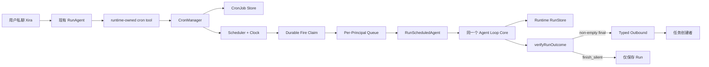

# Xira Cron v0 架构方案

> 状态：Proposed，尚未实现。
>
> 目标：为 Xira 增加可持久化、按 sender 隔离的周期任务能力。
>
> 核心约束：Cron 只提供新的触发方式；到点后复用现有 Agent Loop，不形成第二套 Runtime。

## 0. 结论

Xira v0 只实现一套 `CronManager` 和一个 runtime-owned `cron` tool。同一 entrypoint
下，每个授权 sender 拥有独立 Cron namespace。任务到点后以创建者作为服务端绑定的
Principal，启动不继承聊天 session 的 Scheduled Turn；非空 final 固定投递给创建者，
`finish_silent` 表示成功但不发送。

`owner` 只是 entrypoint 授权的一种来源，不是该 entrypoint 下所有 CronJob 的所有者，
也不自动获得管理其他 sender 任务的权限。

## 1. 需求与边界

### 1.1 v0 必须支持

1. 授权 sender 在私聊中用自然语言 create/list/pause/resume/delete CronJob。
2. 创建时持久化 `agent_id`、名称、五字段 expression、IANA timezone 和 Prompt。
3. sender 只能查看和管理自己的任务；同一 entrypoint 可安全服务多人。
4. 每个 Fire 使用新 ADK session，不读取聊天主 session 或聊天记录。
5. Scheduled Turn 加载创建者的 `user.md`、Sender Memory、目标 Agent 的 Agent Memory。
6. Scheduled Turn 的工具数据绑定创建者的 per-sender isolation scope。
7. Job、Run 和 Fire claim 重启可恢复；恢复未来调度但不补历史 Fire。
8. 每次 Fire 前重新验证 entrypoint、Principal、Agent、route 和工具权限。
9. CronRun 分开记录 execution 与 delivery，投递失败不能重跑 Agent。

### 1.2 非功能要求

- 身份和 recipient 只能由服务端绑定，模型不能提供或覆盖。
- 单进程支持范围内，同一 Fire 只能 durable claim 一次。
- 有 per-sender 任务数、运行次数、并发和全局并发上限。
- Scheduler 注入 Clock；权限和状态机属于 100% 分支覆盖的契约代码。
- Cron 只负责任务、时间、编排和投递；模型执行继续由 Runtime 负责。
- Prompt、raw sender、final 和凭证不进入普通 Info 日志。

### 1.3 v0 不做

- 独立 HeartbeatManager；Heartbeat 未来编译成 system-owned CronJob。
- 秒级 Cron、descriptor、一次性任务、`update`、`run_now`。
- 群聊创建、owner 跨用户管理、模型指定 recipient/delivery/allowed tools。
- Scheduled Turn HITL resume、Cron 自调用、spawn/delegation。
- 停机 catch-up、多进程共享 Store、CLI/HTTP 与 daemon 并发写 Store。
- 跨 channel person graph；同一人在不同 channel 拥有不同 Cron namespace。

## 2. 总体架构



系统只有一个模型执行核心：

```text
聊天消息 ─────────────┐
                     ├── Agent Loop Core
Cron Scheduled Turn ─┘
```

## 3. Principal、授权与所有权

### 3.1 CronPrincipal

```go
type CronPrincipal struct {
	EntrypointID string `json:"entrypoint_id"`
	Channel      string `json:"channel"`
	SenderID     string `json:"sender_id"`
	SenderIDType string `json:"sender_id_type"`
}
```

所有权键：

```text
(entrypoint_id, channel, sender_id_type, sender_id)
```

规范化规则：

- entrypoint/channel/type trim，channel/type lowercase；
- SenderID 只 trim，不能 lowercase，外部 ID 可能区分大小写；
- typed sender 为空时不能创建 Cron；
- 文件路径使用 versioned 四元组 SHA-256，不使用 raw sender；
- Principal 来自服务端 `InboundContext`，模型和客户端均不能传入；
- Scheduled Turn 使用 Job 中持久化的 Principal，不从 Prompt 恢复身份。

### 3.2 授权

Cron 授权为：

```text
definition.AllowsSender(senderID)
OR ownerResolver.IsOwner(entrypointID, senderID)
```

不能直接复用含 `/bind` pre-auth 的 `ingest.AuthorizeSender`，应抽出不依赖消息内容的接口：

```go
type EntrypointAccessResolver interface {
	AuthorizeCronPrincipal(context.Context, entrypoints.Definition, CronPrincipal) AccessDecision
}
```

管理操作用当前服务端 Principal；每次 Fire 前用 Job Principal 再鉴权。owner 只管理自己的
Job；owner 转移不迁移 Job，旧 owner 不再授权时其 Job 自动 pause。

### 3.3 多 sender 行为

同一 `feishu-main` 中 Alice/Bob 分别创建 `job-a`/`job-b`：

- Alice list 只见 `job-a`，Bob list 只见 `job-b`；
- Alice 猜到 `job-b` 仍得到 `not found`，不用 `forbidden` 泄露任务存在；
- 两个 Fire 分别加载各自 sender context，结果分别发给 Alice/Bob；
- entrypoint owner 不会看到或接收二人的任务。

## 4. Entrypoint 配置与 Tool 准入

### 4.1 配置

```yaml
entrypoints:
  - id: feishu-main
    channel: feishu
    default_agent: xira-assistant
    allowed_senders: [ou_alice, ou_bob]
    data_isolation:
      enabled: true
    cron:
      enabled: true
      allow_public: false
      max_jobs_per_sender: 20
      max_total_jobs: 500
      max_runs_per_hour_per_sender: 12

cron:
  max_concurrency: 4
  max_concurrency_per_principal: 1
  run_timeout: 15m
  misfire_grace: 2m
```

`entrypoints.Definition` 增加 `CronPolicy`。默认 `enabled=false`、`allow_public=false`。
空 `allowed_senders` 或 `*` 对普通聊天仍表示公开，但 Cron 是持续消耗资源的写操作，只有显式
`allow_public=true` 才允许非 owner 创建。Cron v0 还要求 `data_isolation.enabled=true`。

### 4.2 `cron` tool 可见条件

以下条件必须全部满足：

1. CronManager 已注入 Runtime；
2. entrypoint 存在、启用且 CronPolicy enabled；
3. 当前消息是 direct chat；
4. 当前 sender 有非空 typed identity 并通过授权；
5. channel 支持向 typed recipient 主动私聊；
6. data isolation 已启用；公共入口已显式开放 Cron。

eligibility 必须在 instruction/tool schema/Guidance 生成前进入 context。`Available tools`、
真实 ADK schema 和 `# Tool Guidance` 必须同时有或同时没有 `cron`；handler 内仍重复鉴权。

## 5. `cron` Tool 契约

只提供一个 runtime-owned tool，`action` 为判别字段。

### 5.1 create

```json
{
  "action": "create",
  "agent_id": "sales-agent",
  "name": "工作日销售日报",
  "expression": "0 9 * * 1-5",
  "timezone": "Asia/Shanghai",
  "prompt": "检查昨天的销售数据，生成包含异常和建议的日报。"
}
```

| 字段 | 约束 | 使用方 |
|---|---|---|
| `agent_id` | 必填，Profile 存在且 entrypoint 允许 | Runtime |
| `name` | 1-80 rune | CronManager |
| `expression` | 严格五字段，最长 128 byte | Scheduler |
| `timezone` | 有效 IANA TZ，最长 64 byte | Scheduler + Runtime |
| `prompt` | 1-4000 rune | Runtime 用户级输入 |

用户不必说出 Agent；模型可填写当前 Agent ID，但 tool schema 中始终必填，避免持久化任务依赖
未来会变化的默认值。模型不能提供 Principal、entrypoint、channel、recipient、ChatID、delivery、
allowed tools、next time 或 Fire ID。

### 5.2 管理操作

```json
{"action":"list"}
{"action":"pause","job_id":"cron_01..."}
{"action":"resume","job_id":"cron_01..."}
{"action":"delete","job_id":"cron_01..."}
```

- list 只列当前 Principal 的 enabled/paused Job，显示 Agent、schedule、next/last run；
- pause 阻止未来 Fire，不取消 running Run；
- resume 从当前时间算下一次，不补暂停期间 Fire；
- delete 写 tombstone，保留历史和幂等键；
- 名称不唯一，破坏性操作必须使用 Job ID；
- 修改 Agent/Prompt/schedule 采用 delete + create，v0 不做复杂 update 状态机。

### 5.3 创建幂等

```text
CreateKey = sha256(runtime_run_id + "\x00" + tool_call_id)
```

同一 tool call 重试返回原 Job。deleted tombstone 保留 CreateKey，旧 call 重放也不会重建。

## 6. Agent 与工具权限

### 6.1 Agent 必选与允许集合

`agent_id` 必须存在且被 entrypoint 允许。当前 Registry 对隐式 default 与显式请求同一 Agent
的行为不完全对称，实现前统一为：

```text
effective allowed agents = default_agent UNION allowed_agents
```

`allowed_agents` 为空仍表示允许所有已安装 Agent。

### 6.2 能力快照

模型不能传 allowed tools。创建时 Runtime 计算并持久化：

```text
目标 Agent 当前工具 INTERSECT entrypoint/runtime 权限 MINUS Scheduled denylist
```

Fire 时使用：

```text
创建时快照 INTERSECT 当前仍被允许的工具
```

因此权限变化只能收窄旧 Job；新增工具不会自动扩权，需要重建 Job。

Scheduled denylist 包含：`cron`、HITL/human request、聊天进度、`notify_owner`、spawn/delegation
及依赖当前群 ChatID 的工具。允许普通业务工具、Principal-bound 数据工具和 `finish_silent`。
若仍产生 `waiting_human`，Run 失败为 `interactive_not_supported`。

## 7. Job、Fire 与 Run 模型

### 7.1 CronJob

```go
type CronJob struct {
	SchemaVersion string
	ID            string
	Principal     CronPrincipal
	AgentID       string
	Name          string
	Expression    string
	Timezone      string
	Prompt        string
	State         string // enabled | paused | deleted
	AllowedToolsSnapshot []string
	CreateKey, CreatedByRunID, CreatedByCallID string
	CreatedAt, UpdatedAt time.Time
}
```

- ID 使用 UUID/ULID，不含 sender、Prompt 或 ChatID；
- 除 state 外 v0 不原地修改；deleted 保留 tombstone；
- `next_run_at` 不是持久化真相，由 expression/timezone/当前时间计算；
- Job 不保存模型选择的 recipient，Principal 是唯一 recipient 来源。

### 7.2 字段职责

| 字段 | CronManager/Scheduler | Runtime |
|---|---|---|
| expression | Parse/Next | 不传模型 |
| timezone | 解释时间 | 可信时间上下文 |
| prompt | 持久化 | 用户级任务 |
| agent_id | 校验/保存 | 选 Profile |
| principal | 所有权/授权/配额 | 记忆和工具隔离 |
| scheduled_at | 生成 Fire | 解释“今天/昨天” |

### 7.3 Fire 与 CronRun

```text
FireID = sha256("cron-fire-v1\x00" + jobID + "\x00" + scheduledAtUTC)
```

执行前 create-if-absent 持久化 `(job_id, scheduled_at_utc)` claim。

CronRun 保存 Job/Fire/Principal key、UTC 和本地计划时间、AgentRunID、开始结束时间，以及两套状态：

```text
execution: claimed | queued | running | completed | failed |
           skipped_overlap | skipped_misfire | skipped_quota | blocked | interrupted
delivery:  pending | sent | not_needed | failed | not_allowed
```

模型、工具、事件和 usage 继续在现有 Runtime RunStore；CronRun 只用 AgentRunID 关联。

## 8. Scheduled Turn 与上下文

### 8.1 正式 Runtime 入口

禁止伪造 `ChatType=direct, ChatID=senderID`。新增：

```go
type ScheduledTurnRequest struct {
	JobID, FireID, EntrypointID string
	Principal CronPrincipal
	AgentID, Prompt string
	ScheduledAt time.Time
	Timezone string
	AllowedTools []string
}

func (s *Service) RunScheduledAgent(context.Context, ScheduledTurnRequest) (ScheduledResult, error)
```

`RunAgent` 和 `RunScheduledAgent` 适配入参后调用同一个私有 Agent Loop Core，共享 instruction、
model、tool、failure guard、`verifyRunOutcome`、Runtime events、RunStore 和 usage。

### 8.2 Session/Memory 契约

| 上下文 | Scheduled Turn |
|---|---|
| 聊天主 session / history | 不复用、不 hydrate |
| ADK session | 每 Fire 新建 `cron:<job>:<fire>` |
| SessionScope / InheritSession | `nil` / `false` |
| Principal | Job 创建者 |
| `user.md` / Sender Memory | 加载创建者的 |
| Agent Memory | 加载目标 Agent 的现有跨-sender memory |
| 工具数据 | 使用创建者 isolation scope |
| EventBus / ChatContext | 不创建，不发 live progress |
| HITL pending | 不支持 |

Agent Memory 按当前 Xira 契约属于 Agent、跨 sender 共享；Cron 不偷偷改变 memory 模型。
如果未来需要强多租户 Agent Memory，另立 memory policy 方案。

Runtime 注入 sealed trigger block：

```text
Trigger: cron
Job ID / Fire ID: ...
Scheduled at: 2026-07-16T09:00:00+08:00
Timezone: Asia/Shanghai
Principal: current scheduled-task owner
Conversation: none
```

随后把 Job Prompt 作为用户级输入。“昨天”按计划时刻和 Job timezone 解释，不按实际排队开始时间。

Scheduled Turn 没有 per-chat-key sink：事件仍先写 Run history，无 sink signal 按当前契约 Debug log；
CronManager 从 `RunScheduledAgent` 的已验证结果投递，不能把 `run.finished` 当 final-ready 信号。

## 9. Scheduler 与时间语义

### 9.1 库与 Parser

使用 `github.com/robfig/cron/v3 v3.0.1`，并 `_ "time/tzdata"`。Parser 只启用
Minute/Hour/Dom/Month/Dow，拒绝秒字段和 descriptor。expression/timezone 分开持久化。

robfig 只负责 Parse 和 `Schedule.Next`；Xira 自己负责 timer、持久化、claim、queue、Run、授权和投递。

### 9.2 时间规则

- timezone 必须通过 `time.LoadLocation`，不回退服务器默认时区；
- 春季不存在的本地时间跳过；秋季重复时间按 pinned `Next` 语义，不自行消重；
- Fire identity 使用 UTC 时刻；DST 行为用 pinned 版本测试锁定；
- 启动、reload、resume 从当前时间算下一次，不 catch up；
- timer 延迟不超过 `misfire_grace` 仍执行，超过则 `skipped_misfire`；
- Scheduler 注入 `Clock{Now, NewTimer}`，测试不用真实 sleep；
- Job mutation/config reload 通过 wake channel 触发重新计算。

### 9.3 并发和恢复

- 全局 running 默认 4、每 Principal 默认 1；
- 同 Principal 不同 Job 按 scheduled time/Job ID 稳定排队；
- 同 Job 上一 Run 未完成时，新 Fire `skipped_overlap`；
- 每 Run 默认超时 15 分钟；小时配额耗尽 `skipped_quota`；
- shutdown 取消 context 并记 `interrupted`，重启不自动重跑；
- v0 是单进程 writer，不声称跨进程 exactly-once。

v0 选择 at-most-once attempt：claim 后崩溃不自动重跑，因为工具可能有副作用。未来 retry 必须
建立 Job/工具幂等契约，不能全局默认重试。

## 10. 持久化

```text
<state_dir>/cron/
├── jobs/<principal-sha256>/<job-id>.json
└── runs/<job-id>/<fire-id>.json
```

- 目录 `0700`、文件 `0600`；临时文件 + fsync + atomic rename；
- Job/Run 带 schema version；raw sender 不进路径，Prompt 不进 Info log；
- delete 写 tombstone；只有 CronManager 写该目录；
- store 根不可读/不可写时 CronManager 启动失败；
- 单文件损坏时保留原文件、记录 Error/degraded health，其他健康任务继续；
- 不静默跳过，也不自动删除或“修复”损坏文件。

## 11. 结果投递与权限变化

### 11.1 固定投递语义

v0 不提供 `delivery: owner | none`：owner 不是通用 recipient，`none` 又会制造隐形任务。

- `status=completed && final!=""`：使用当前 entrypoint route 主动私聊 Job Principal；
- 成功 `finish_silent`：execution completed、delivery not_needed；
- 普通空 final、截断、工具失败：沿用 `verifyRunOutcome` 判失败；
- 安全失败通知不含 Prompt、堆栈、凭证或敏感工具错误；
- delivery failure 只记 failed，不能重跑 Agent。

recipient 固定为：

```go
channel.OutboundRecipient{ID: principal.SenderID, IDType: principal.SenderIDType}
```

不用旧 ChatID、不发 owner。channel 不支持 typed proactive direct 时，Cron tool 不可见。

### 11.2 Fire 前复核与自动暂停

依次检查 Job enabled、entrypoint/CronPolicy、Principal 授权、Agent、route/type、工具交集和配额。

| 原因 | Job 行为 | 通知 |
|---|---|---|
| principal revoked | 自动 pause | 不联系已撤权 sender |
| entrypoint/CronPolicy disabled | 自动 pause | 不投递 |
| Agent unavailable/disallowed | 自动 pause | sender 仍授权时通知 |
| route/type incompatible | 自动 pause | 能安全投递才通知 |
| quota exhausted | 保持 enabled，本次 skip | 不逐次刷屏 |

使用 entrypoint 当前凭证/account，凭证轮换不改变所有权；channel/ID type 不兼容则 pause。

## 12. 包边界与生命周期

建议新增：

```text
apps/xira/internal/cron/{model,principal,parser,store,scheduler,manager,quota,interfaces}.go
apps/xira/internal/runtime/{cron_tool,scheduled_turn}.go
```

`internal/cron` 不依赖具体 Feishu，也不实现模型循环，通过接口依赖 Runtime Executor、Deliverer、
AccessResolver。Cron tool 管 schema/当前 Principal；Manager 管 Job/授权/配额；Scheduler 管时间/claim/
queue；Runtime 管 Agent Loop；Deliverer 管 current route + typed recipient。

启动顺序：配置/registry → Runtime → Channel/Outbound → Store → CronManager → 注入 Runtime →
启动 channels → Scheduler → API。Scheduler 必须晚于 Outbound ready。

关闭顺序：停止 mutation → 停止新 Fire → 取消/等待 Run → 持久化 interrupted → 停 channels/Runtime。

## 13. 失败模式与可观测性

| 失败 | 处理 |
|---|---|
| expression/timezone 非法 | create 失败，不用隐式默认 |
| tool call 重试 | CreateKey 返回原 Job |
| timer 重复唤醒 | durable Fire claim 去重 |
| claim 后崩溃 | interrupted，不自动重跑 |
| 单 Job 文件损坏 | degraded，其他 Job 继续 |
| Store 根故障 | CronManager 启动失败 |
| sender 撤权/Agent 删除/route 变化 | 自动 pause |
| 同 Job 过久 | 新 Fire skipped_overlap |
| waiting_human | failed interactive_not_supported |
| outbound 失败 | delivery failed，不重跑 Agent |

日志包含 Job/Fire/Principal hash、entrypoint、Agent、计划/开始/结束、queue/execution/delivery latency、
状态与原因；不含 raw Prompt/sender/final/secret。指标至少覆盖 Job 数、Fire 状态、active runs、queue
latency、execution time、delivery status 和 degraded records。

## 14. 关键架构决策（ADR 摘要）

| 决策 | 选择 | 代价 / 拒绝方案 |
|---|---|---|
| 单 Scheduler | Heartbeat 未来转 system CronJob | 不接受两套时间/恢复基础设施 |
| Job 所有者 | typed Principal，不是 owner/chat | 跨 channel 同人暂不合并 |
| Agent 执行 | 同一 Loop Core、fresh session | 需要抽取聊天适配与通用核心 |
| Delivery | final 给 Principal，silent 用工具 | v0 不发群/owner/第三人 |
| Cron 库 | pin robfig，仅 Parse/Next | Xira 自己维护小型 scheduler loop |
| 重试语义 | at-most-once attempt | 极端崩溃可能漏一次，但避免重复副作用 |
| 权限快照 | 创建快照 ∩ 当前权限 | 新工具不会自动进入旧 Job |
| 公共入口 | 默认不开放 Cron | 需 operator 显式承担成本风险 |

## 15. 当前代码要补的契约

1. 独立 Cron access resolver，不能复用含 `/bind` 特例的消息授权。
2. 统一显式 `default_agent` 与隐式 default 的 AllowsAgent 语义。
3. Scheduled Turn 使用一等 Principal，不能伪造 ChatID/SessionScope。
4. instruction 输入拆成 Principal + optional Conversation，按 Principal 加载 user/memory。
5. Cron capability gate 在 instruction/schema/Guidance 编译前生效，handler 再鉴权。
6. Scheduled tool scope 从 Principal 获取 data-isolation key。
7. channel adapter 暴露 typed proactive direct capability。
8. Cron 使用已验证 TurnResult，不能拿 `run.finished` 推断 final。
9. Scheduler 生命周期晚于 Outbound ready、早于 channel shutdown 停止。

这些是核心契约，不能在 CronManager 里复制近似逻辑绕过去。

## 16. TDD、验证与实施

### 16.1 契约测试（100% 分支）

- Principal normalize/hash：空 typed ID、大小写、`/`、Unicode、路径安全；
- authorization：allowlist、owner fallback、public guard、撤权；
- ownership：list/pause/resume/delete 隔离，猜他人 ID 返回 not found；
- Job state machine 与 CreateKey；Agent default/explicit/allowlist；
- tool visibility：direct/group、typed/untyped、policy、manager、channel capability；
- effective tools/schema/Guidance 同步；能力快照和 denylist；
- execution/delivery 两套状态转换。

### 16.2 Scheduler/Runtime 测试

- 五字段 parser、timezone、DST、fake Clock、wake、next preview；
- startup/resume no catch-up、misfire、claim、overlap、配额、公平、shutdown；
- 单坏文件 degraded、Store 根故障；
- 真实 `RunScheduledAgent -> ADK request`，fresh session、无 chat history；
- 用真实 InboundContext 产出 Principal，不手搓干净 ID；
- 正确 sender user/memory/data scope，Agent Memory 按现契约加载；
- sealed trigger、expression 不进模型、timezone/scheduled_at 进入；
- final、finish_silent、tool failure、空 final、waiting_human；
- 双 sender E2E：管理/上下文/数据/投递隔离，撤权与 owner 转移。

### 16.3 全量验证

遵守 `AGENTS.md`：先失败测试，包级语句覆盖率至少 85%，契约函数每个分支/case 100%。

```bash
go build ./...
go test ./...
go test -race ./apps/xira/internal/cron/... ./apps/xira/internal/runtime/...
task live-test
```

覆盖率用 `go test -coverprofile` + `go tool cover` 按语句核算；真实 DeepSeek live test 必须双门控，
确认没有 live test 的 `SKIP`。

### 16.4 实施切片

1. **Contract**：冻结 Principal/Job/Run/tool schema，先写契约失败测试。
2. **Cron Core**：parser/store/fake Clock scheduler/claim/state/quota，用 fake Executor 验证。
3. **Scheduled Turn**：抽共享 Loop Core，接 Principal/memory/tool scope/verifyRunOutcome。
4. **Cron Tool**：CronPolicy/access resolver/tool schema/Guidance/idempotent CRUD。
5. **Delivery/Lifecycle**：typed proactive、final/silent/failure、撤权、wiring、metrics。
6. **E2E/Live**：双 sender、restart/DST/delivery failure、全仓 build/test/race/coverage/live。

每个切片单独可验收，不把 Scheduler、Runtime 重构、channel delivery 全揉进一个 PR。

## 17. 验收标准

1. 同一 entrypoint 两个授权 sender 可创建任务，但无法发现、管理或接收对方任务。
2. owner 没有隐含跨 sender 管理能力；agent_id 显式持久化并受 entrypoint 限制。
3. Scheduled Turn 复用现有 Agent Loop，但不复用聊天 session/history。
4. expression/timezone 属于 Scheduler；Prompt/Agent/Principal/计划时间进入 Runtime 正确层级。
5. final 固定投创建者，`finish_silent` 不发送，投递失败不重跑 Agent。
6. tool/schema/Guidance/handler 授权一致；Scheduled Turn 不可自建 Cron 或进入 HITL。
7. 重启恢复未来 Fire，不 catch up，不重复 claim；execution/delivery 独立记录。
8. 撤权、Agent 不可用或 route 不兼容自动 pause；坏记录显式 degraded。
9. 没有第二套 Agent Loop、全局 EventBus 或模型可控 recipient。
10. 契约覆盖率 100%、包级覆盖率达标，全仓 build/test/race/live 通过。

## 18. 参考

- `AGENTS.md`
- `docs/architecture/xira-runtime-current-contract.zh.md`
- `docs/architecture/xira-ownership-isolation-v0.zh.md`
- `docs/architecture/xira-per-chat-key-architecture-rfc-v0.zh.md`
- `docs/architecture/xira-conversation-progress-feed-v0.zh.md`
- `docs/issues/009-memory-system.md`
- `apps/xira/internal/entrypoints/registry.go`
- `apps/xira/internal/channelrunner/ingest/ingest.go`
- `apps/xira/internal/channel/outbound.go`
- `apps/xira/internal/runtime/service.go`
- `apps/xira/internal/runtime/tool_guidance.go`
